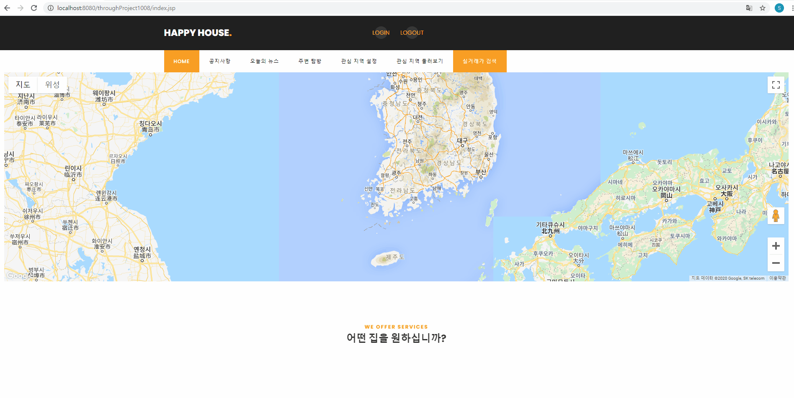
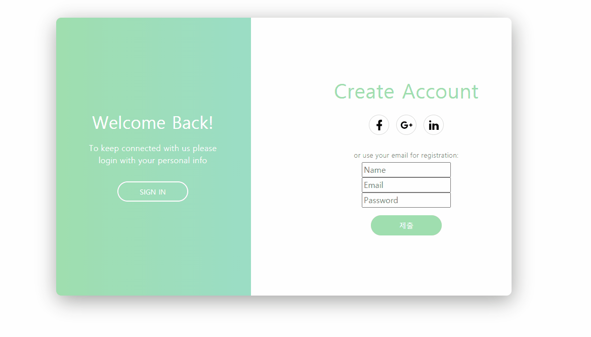
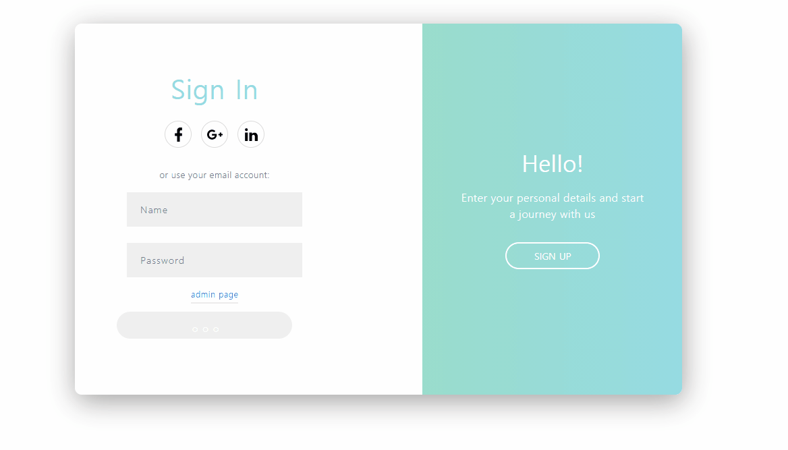
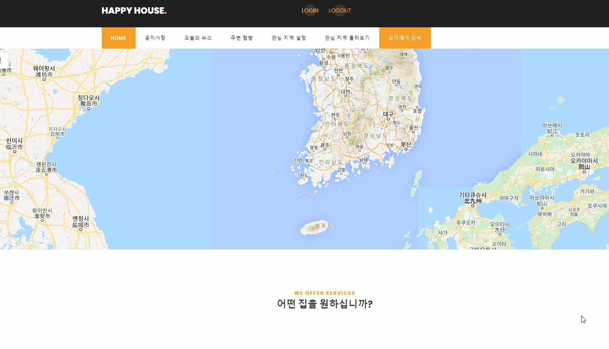
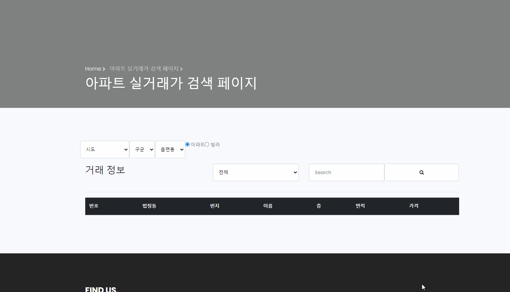
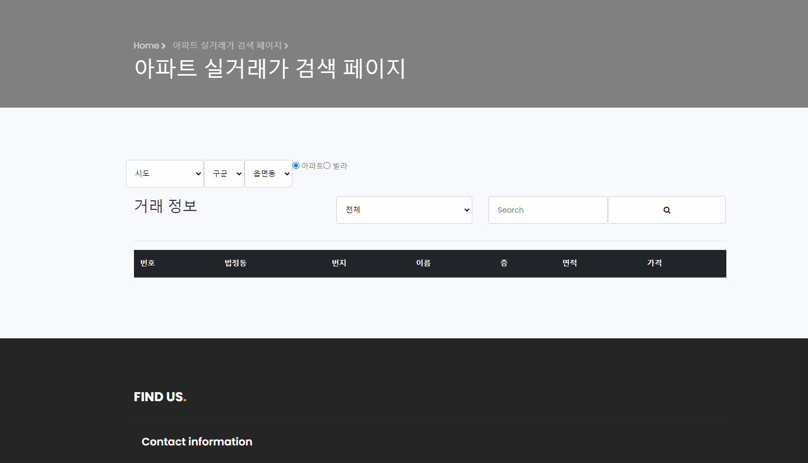
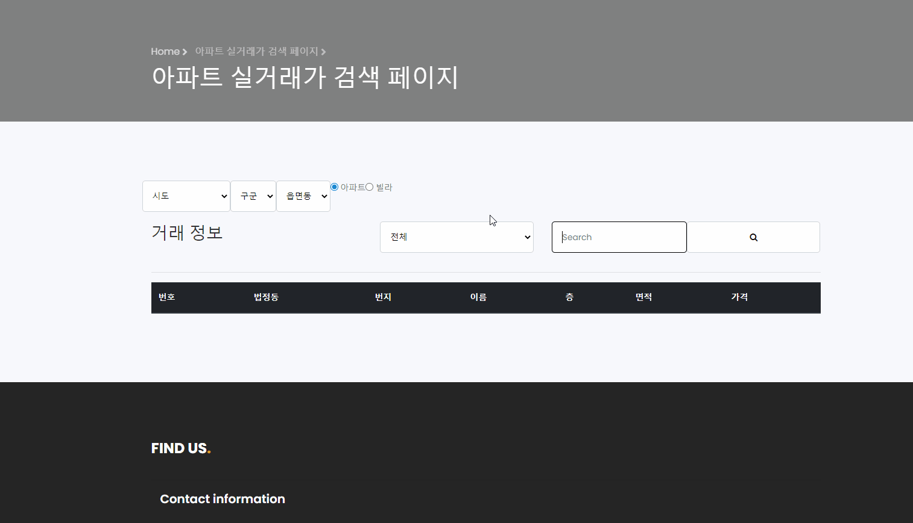
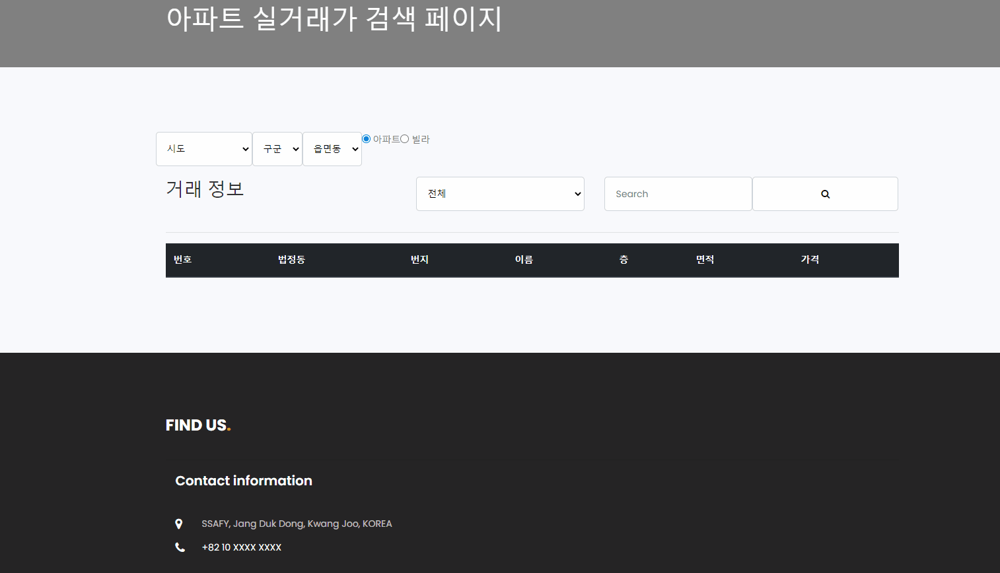
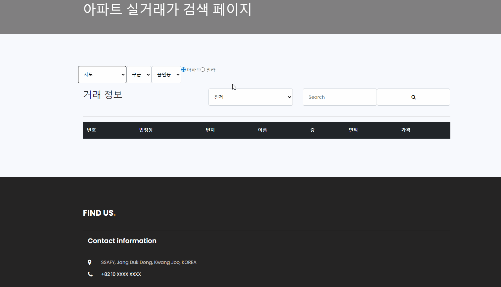

관통 프로젝트 제출 방법

# 관통프로젝트: HappyHouse_Database_광주_02반
### 제출일: 2020.10.16
### 참여 페어
- 조한빈(조장), 윤승환

### 처리된 요구사항 목록
  
|난이도|구현기능|세부|작성여부(O/X)|
|:---:|---|---|:---:|
|기본|회원 정보 데이터 관리|회원 정보 수정, 삭제, 조회, 가입, 로그인, 로그아웃|O|
|기본|아파트 실거래가 데이터 관리|아파트 정보로 번호, 동, 이름, 층, 면적, 가격 검색|O|
|기본|주택 실거래가 데이터 관리|주택 정보로 번호, 동, 이름, 층, 면적, 가격 검색|O|
|기본|Q&A게시판 관리|게시판 글 등록, 수정, 삭제|O|

구현 기능 : 메인페이지

구현 기능 : 회원정보 등록 기능

구현 기능 : 로그인 기능

구현 기능 : 아파트 동별 상세검색

구현 기능 : 주택 동별 상세검색

구현 기능 : 아파트 이름 검색

구현 기능 : 주택 이름 검색

구현 기능 : 아파트 전체 검색

구현 기능 : 주택 전체 검색

